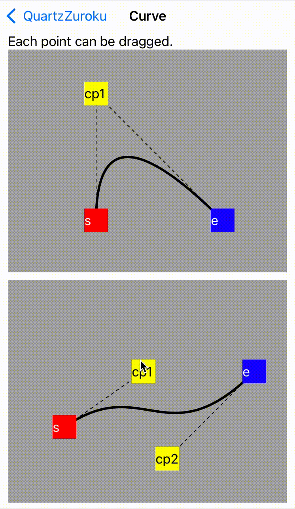
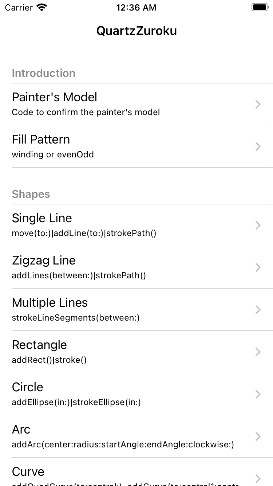
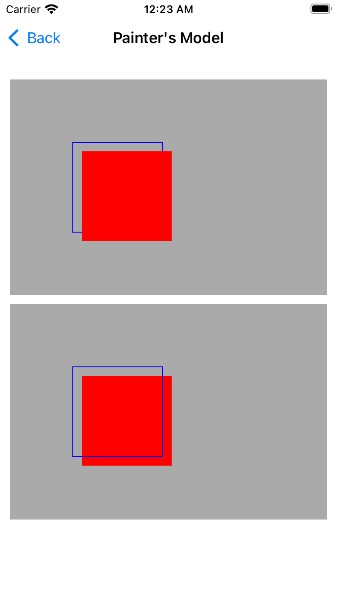
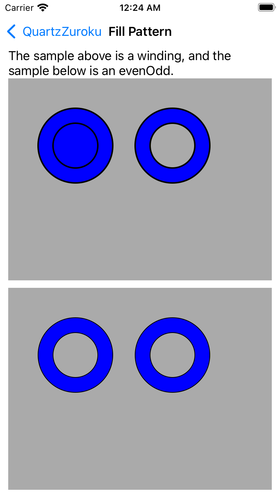
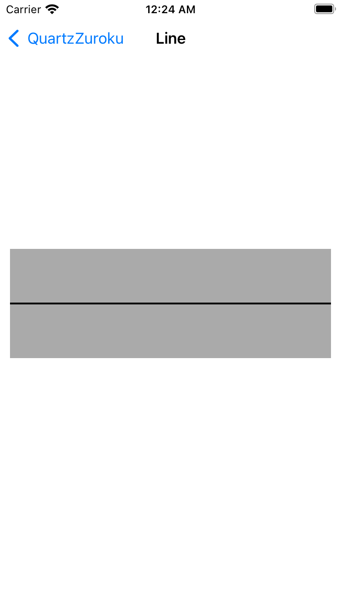
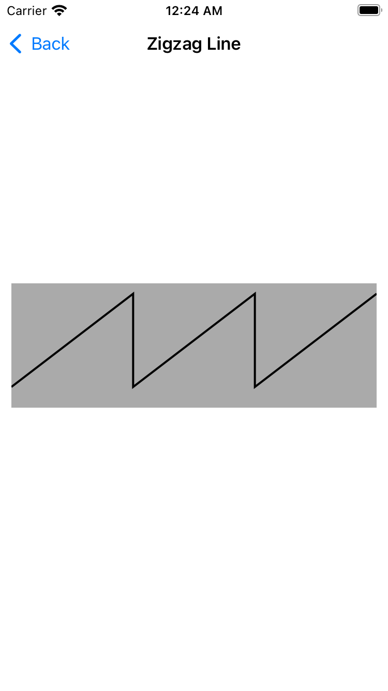
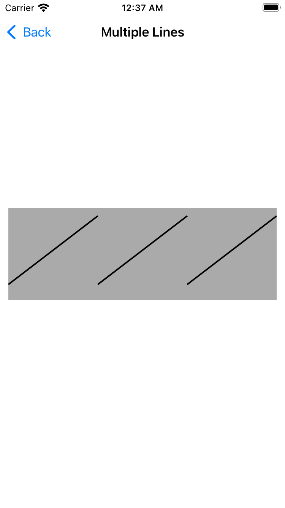
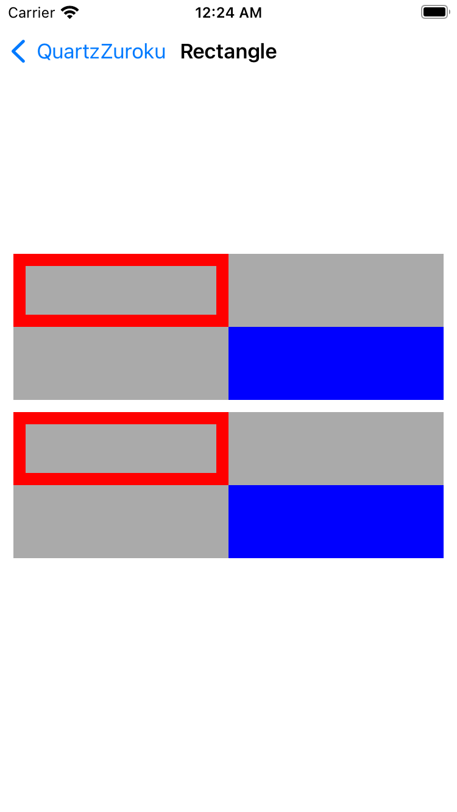
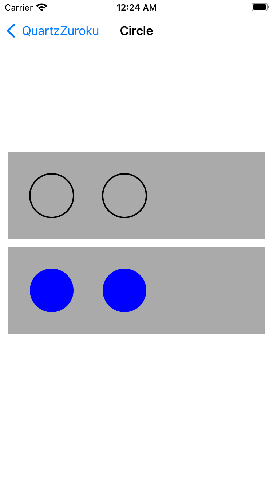
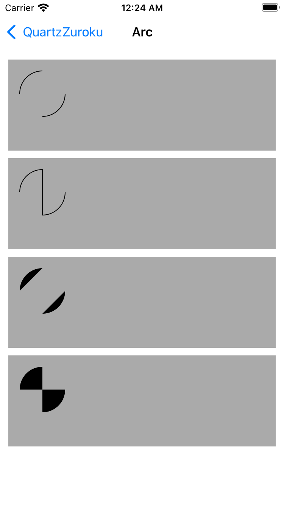

# QuartzZuroku - クオーツ図録 (iOS Core Graphics examples) 

This is a sample code collection for **[→ Core Graphics (Quartz) tutorial on my blog](https://snoozelag.hatenablog.com/entry/2021/10/26/055223)**.
 

## How to build

Just build with Xcode 13. Runs on iPhones with iOS13 or higher, as it contains SwiftUI code.

## Contents

   

   

   

#### Samples

Lines / Rectangles / Circle / Arc / Curve / SwiftUI / CALayer / UIImage  
These sample code is included.

## Author

**Teruto Yamasaki**

iOS programmer in Japan.

- CONTACTS: [Twitter @snoozelag](https://twitter.com/snoozelag) / [Facebook](https://www.facebook.com/teruto.yamasaki)
